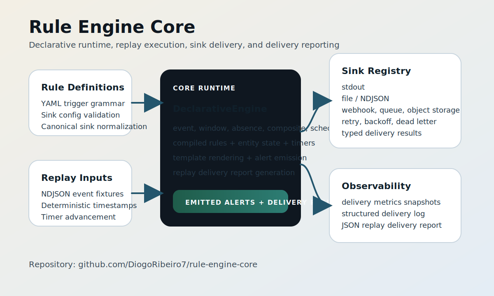

# Rule Engine Core

This repository contains the core runtime for a generic declarative rule engine.
It currently provides an executable in-memory replay engine and is being
extended toward a fully implemented sink delivery system.



## Current State

- Canonical runtime model: keyed execution with domain-specific identifiers supplied by the caller.
- Entities are keyed by caller-supplied identifiers, with `rule_id` used as the per-rule namespace.
- Declarative rules now compile into executable in-memory runtime objects.
- Compile-time rule loading is now separated from execution through `rule_engine.compiler` and `CompiledEngine`.
- Declarative rules are schema-validated at load time with path-aware errors for malformed YAML and bad field shapes.
- Trigger fields, condition operators, duration values, and cron expressions are validated before execution.
- Runtime startup behavior is configurable through `EngineConfig` and explicit sink-registry injection.
- Embedding code can now consume typed `RuleMetadata` and `EvaluationResult` objects.
- The core package now passes `mypy` and is checked for type regressions in CI.
- Replay evaluation supports `event`, `window`, `absence`, `composite`, and `scheduled` triggers.
- Unit tests assert alert behavior, timer expiry, and lookback handling.
- Fixture-driven golden tests now lock replay JSON output for the sample scenarios.
- A first-class sink contract now exists, with `stdout`, file, webhook, queue, and object-storage sinks implemented.
- Declarative sink configs are validated at rule-load time and normalized onto canonical sink types.
- Sink dispatch now supports bounded retries, configurable backoff, dead-letter recording, delivery metrics snapshots, and structured delivery logs.
- Delivery observability now covers overall and per-sink counts, retry activity, unsupported routes, dead letters, and measured delivery latency.
- Replay execution can now return a typed delivery report, and the CLI can emit alerts plus delivery telemetry as JSON.
- Sink delivery is still incomplete at the production-integration level; stronger backend integrations and broader policy controls are still pending.

## Repository layout

- `rule_engine/` — generic Python reference implementation.
- `rule_engine/compiler.py` — compile-time API for turning declarative rules into executable runtime objects.
- `rule_engine/api.py` — lightweight embedding API for building and replaying engines from code.
- `rule_engine/models.py` — public runtime models for alerts, metadata, evaluation results, and engine config.
- `tests/` — unit tests for rule semantics and timing behavior.
- `tests/fixtures/replay/` — golden replay cases and expected JSON outputs for sample scenarios.
- `sample_rules/` — sample declarative rules used as reference fixtures.
- `sample_data/` — NDJSON fixtures for replay-based tests and demos.
- `docs/architecture.svg` — public-facing architecture diagram for repo pages and social sharing.
- `docs/rule-language.md` — exact supported declarative rule-language subset.
- `docs/linkedin-project-kit.md` — reusable LinkedIn project copy, post text, and publishing checklist.
- `ROADMAP.md` — prioritized next steps for stabilizing and extending the engine.
- `LICENSE` — MIT license for public reuse.

## Scope

What this repo is:

- a core rule-evaluation runtime
- a declarative YAML rule compiler/executor
- a compile/runtime split that supports embedding compiled rules without going through the CLI
- an explicit engine-configuration surface for runtime startup and scheduling behavior
- a lightweight embedding API for building engines from YAML, files, or precompiled rules
- typed metadata and evaluation result objects for embedding and inspection
- cleaner module boundaries between execution logic and public runtime models
- a replay engine for deterministic testing and validation
- the base for sink delivery adapters, with `stdout`, file, webhook, queue, and object-storage support already present
- an explicit sink configuration grammar with canonical sink names
- a formal declarative rule schema with fail-fast load-time validation
- compile-time validation for trigger semantics, durations, cron syntax, and condition grammar edges
- a delivery layer with retry, backoff, dead-letter, delivery-metrics, and structured-delivery-log primitives
- a replay/report surface for downstream tooling and automation
- a type-checked core package with CI enforcement

What this repo is not yet:

- a production streaming platform
- a complete sink delivery system
- a workflow orchestration tool
- a UI or rule-management product

## Quick start

Install the development dependencies:

```bash
python -m pip install -e .[dev]
```

Run the reference tests:

```bash
python -m pytest
```

Run the linter:

```bash
python -m ruff check .
```

Run type checking:

```bash
python -m mypy
```

Auto-format the repo:

```bash
python -m ruff format .
```

Run a declarative YAML rule demo:

```bash
python -m rule_engine.runner sample_rules/source_gap.yaml
```

Replay a declarative YAML rule against a sample NDJSON event fixture:

```bash
python -m rule_engine.runner sample_rules/source_gap.yaml --events sample_data/source_gap_events.ndjson
```

Replay a timer-driven rule and advance the engine past the final event:

```bash
python -m rule_engine.runner sample_rules/dual_source_gap.yaml --events sample_data/dual_source_gap_events.ndjson --until 2023-11-15T12:26:40+00:00
```

Emit replay alerts together with the delivery report as JSON:

```bash
python -m rule_engine.runner sample_rules/dual_source_gap.yaml --events sample_data/dual_source_gap_events.ndjson --until 2023-11-15T12:26:40+00:00 --delivery-report-json
```

Emit the declarative rule schema as JSON:

```bash
python -m rule_engine.runner --rule-schema
```

Embed the runtime from Python using the compile/runtime split:

```python
from rule_engine.compiler import compile_rule
from rule_engine.declarative import load_rule_yaml
from rule_engine.runtime import CompiledEngine, EngineConfig

compiled_rule = compile_rule(load_rule_yaml(yaml_text))
engine = CompiledEngine(
    [compiled_rule],
    config=EngineConfig(initial_watermark=start_time),
)
alerts = engine.replay(events)
```

Use the higher-level embedding API when you do not need to manage the compiler directly:

```python
from rule_engine.api import build_engine_from_yaml

embedded = build_engine_from_yaml([yaml_text])
result = embedded.evaluate(events)
alerts = result.alerts
metadata = embedded.rule_metadata()
```

## Supported Language

The exact supported declarative subset is documented in
`docs/rule-language.md`. Use that file as the repo-level contract for:

- trigger types and allowed trigger fields
- duration and cron syntax
- condition and operand operators
- aggregation functions
- sink configuration grammar
- explicitly unsupported features

## Public Presentation

The repository is public and intended to be linkable as a portfolio project.
Use `docs/architecture.svg` for visual context and `docs/linkedin-project-kit.md`
for ready-to-publish LinkedIn project text and post copy.

## Roadmap Alignment

This repository is organized around a single canonical runtime model. The
runtime package is generic and can be reused for domains that fit the same
event-and-timer evaluation model.

The current development target is no longer just a reference runtime. The end
goal is a production-capable core with a fully implemented sink delivery
system. The detailed plan for that work lives in `ROADMAP.md`.

## Maintenance Rule

`README.md` should describe the current repo truth, not the intended future
state. When the runtime surface, supported rule language, or sink delivery
capabilities change, update this file in the same change set.

