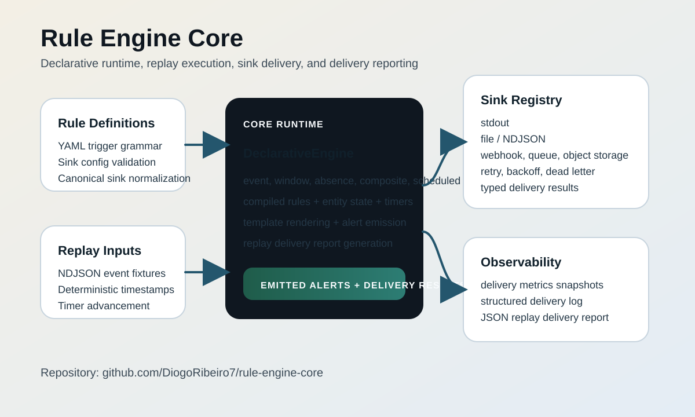

# Rule Engine Core

[](https://doi.org/10.5281/zenodo.22001698)

A declarative rule engine for event streams — write conditions in YAML, evaluate
them deterministically over timestamped events, and deliver the resulting alerts
through reliable sink adapters.



## What this is

This is a **complex event processing (CEP) runtime**: a small, embeddable library
that turns declarative rules into executable objects and runs them against a
stream of entity-keyed events. It handles the parts of that problem that are
tedious to get right — event-time semantics, absence and window triggers, schema
validation with useful errors, and at-least-once delivery with retries,
idempotency keys, and dead letters.

It is a library and a replay tool, not a running service. There is no ingestion
layer, no scheduler daemon, and no UI. You either drive it from the CLI over an
NDJSON file, or embed it in your own process.

The engine is domain-neutral. Events are `entity_id` + `sensor_type` + values +
timestamp; everything domain-specific lives in the rules you write.

## Example

A rule (`sample_rules/examples/facility_temperature_spike.yaml`):

```yaml
rule_id: facility_temperature_spike
description: Emit when a facility temperature reading exceeds the threshold
trigger:
  type: event
sources:
  - sensor_type: facility_temperature
    entity_id: "*"
condition:
  operator: AND
  operands:
    - metric: value
      operator: gt
      value: 85
actions:
  - severity: critical
    message: "High facility temperature for {{entity_id}}: {{value}}"
    sinks:
      - type: stdout
```

Events are NDJSON:

```json
{"entity_id":"facility-1","sensor_type":"facility_temperature","value":81.0,"timestamp_ms":1704067200000}
{"entity_id":"facility-1","sensor_type":"facility_temperature","value":91.0,"timestamp_ms":1704067260000}
```

Replay them:

```bash
python -m rule_engine.runner \
  sample_rules/examples/facility_temperature_spike.yaml \
  --events sample_data/examples/facility_temperature_spike.ndjson
```

```text
2024-01-01T00:01:00+00:00 entity=facility-1 rule=facility_temperature_spike severity=critical message=High facility temperature for facility-1: 91.0
```

## How it works

Three stages, deliberately separated so each can be used on its own.

**1. Compile** — `rule_engine/declarative.py`, `rule_engine/compiler.py`

Declarative YAML is validated against a formal schema and compiled into runtime
objects before anything executes. Trigger fields, condition operators, duration
strings, cron expressions, and sink configs all fail fast at load time with
path-aware errors rather than surfacing mid-replay.

**2. Execute** — `rule_engine/runtime.py`

`CompiledEngine` evaluates compiled rules against events in time order, keyed by
caller-supplied `entity_id` with `rule_id` as the per-rule namespace. Execution
is deterministic: the same events and the same watermark always produce the same
alerts, which is what makes the golden-file tests possible. Timer-driven rules
(`absence`, `scheduled`) advance via an explicit watermark rather than wall
clock, so `--until` can push the engine past the final event.

Event-time order is enforced rather than assumed. `replay()` sorts a batch
before evaluating it; `advance_to()` refuses an earlier target. A rule can
declare `allowed_lateness` to tolerate events arriving behind the watermark,
which are folded into rule state in place without rewinding time. Anything
later than that is governed by `EngineConfig.late_event_policy` — `reject`
(default) or `drop`. `CompiledEngine.watermark` exposes the current position and
`late_event_metrics()` reports what arrived late. See `docs/rule-language.md`
for the exact semantics.

**3. Deliver** — `rule_engine/sinks.py`

Alerts are dispatched through a `SinkRegistry` of adapters. Non-stdout sinks
share one versioned delivery envelope carrying a deterministic idempotency key.
Dispatch supports bounded retries with configurable backoff, dead-letter
recording (in-memory or file-backed, with optional retention bounds and fsync),
and a metrics snapshot covering per-sink counts, retry activity, unsupported
routes, and measured latency.

### Triggers

| Type | Fires when |
| --- | --- |
| `event` | A matching event satisfies the condition |
| `window` | An aggregate over a time window satisfies the condition |
| `absence` | No matching event arrives within a timeout |
| `composite` | Per-source `absence` timers combine under the rule's `AND`/`OR` operator |
| `scheduled` | A cron expression elapses |

Aggregations available to `window` rules: `count`, `sum`, `mean`, `min`,
`max`, `stddev`, `delta`, `rate`, and `percentile`, optionally bucketed by a
`sub_window`.

### Sinks

| Type | Notes |
| --- | --- |
| `stdout` | Local development and debugging |
| `file` | Append-oriented local output, with `timeout_s` |
| `webhook` | Auth headers and HMAC body signing |
| `queue` | Pluggable `QueueTransport` |
| `object_storage` | Pluggable `ObjectStorageTransport`, with `timeout_s` |

## Embedding

The high-level API covers most cases:

```python
from rule_engine import build_engine_from_yaml, create_sink_registry

sink_registry = create_sink_registry(
    dead_letter_path="output/dead_letters.ndjson",
    dead_letter_max_records=1000,
    dead_letter_fsync=True,
)

embedded = build_engine_from_yaml([yaml_text], sink_registry=sink_registry)
result = embedded.evaluate(events)

alerts = result.alerts
metadata = embedded.rule_metadata()
failed = result.delivery_report.failed_entries()
metrics = result.delivery_report.delivery_metrics.to_dict()
```

Drop to the compiler directly when you want to own compilation and reuse
compiled rules across engines:

```python
from rule_engine.compiler import compile_rule
from rule_engine.declarative import load_rule_yaml
from rule_engine.runtime import CompiledEngine, EngineConfig

compiled_rule = compile_rule(load_rule_yaml(yaml_text))
engine = CompiledEngine(
    [compiled_rule],
    config=EngineConfig(initial_watermark=start_time),
    sink_registry=sink_registry,
)
alerts = engine.replay(events)
```

`EvaluationResult`, `RuleMetadata`, `ReplayDeliveryReport`, and
`DeliveryMetricsSnapshot` are typed objects with `to_dict()` / `to_json()`
exports for downstream tooling. See `docs/embedding-examples.md` for more
patterns.

## CLI

```bash
# Evaluate rules against an event fixture
python -m rule_engine.runner RULE.yaml --events EVENTS.ndjson

# Advance timers past the final event (absence and scheduled rules)
python -m rule_engine.runner RULE.yaml --events EVENTS.ndjson --until 2023-11-15T12:26:40+00:00

# Emit alerts plus the delivery report as JSON
python -m rule_engine.runner RULE.yaml --events EVENTS.ndjson --delivery-report-json

# Inspect the compiled runtime model, or the schemas
python -m rule_engine.runner RULE.yaml --json
python -m rule_engine.runner --schema
python -m rule_engine.runner --rule-schema
```

Note: the CLI constructs its engine without a sink registry and prints alerts
using its own formatter. Sinks declared in a rule are reported as `unsupported`
in the delivery report rather than delivered. Actual sink delivery requires
embedding the engine with a registry, as shown above.

## Scope

What this repo is:

- a deterministic, replay-first CEP runtime with a documented rule language
- a compile/runtime split that supports embedding compiled rules without the CLI
- a typed public API — metadata, evaluation results, delivery reports
- a delivery layer with retry, backoff, dead letters, and metrics
- a type-checked package with lint and `mypy` enforced in CI

What this repo is not:

- a production streaming platform
- a workflow orchestration tool
- a UI or rule-management product
- a home for domain-specific rule packs

`docs/scope-boundary.md` records why each of those lines is where it is,
including the deliberately narrow cron support and the fixed five-adapter sink
surface.

## Development

```bash
python -m pip install -e .[dev]

python -m pytest            # tests, including golden replay fixtures
python -m ruff check .      # lint
python -m ruff format .     # format
python -m mypy              # type check
```

Requires Python 3.11+. The only runtime dependency is PyYAML.

## Repository layout

| Path | Contents |
| --- | --- |
| `rule_engine/` | The library |
| `rule_engine/compiler.py` | YAML to executable runtime objects |
| `rule_engine/declarative.py` | Rule schema and load-time validation |
| `rule_engine/runtime.py` | `CompiledEngine`, triggers, evaluation |
| `rule_engine/sinks.py` | Sink adapters, retries, dead letters, metrics |
| `rule_engine/api.py` | High-level embedding API |
| `rule_engine/models.py` | Public typed models |
| `rule_engine/runner.py` | CLI |
| `tests/` | Unit, integration, and golden replay tests |
| `tests/fixtures/replay/` | Golden replay cases and expected JSON |
| `sample_rules/`, `sample_data/` | Reference rules and NDJSON fixtures |

## Documentation

| Document | Purpose |
| --- | --- |
| `docs/rule-language.md` | The supported declarative subset — the language contract |
| `docs/delivery-contract.md` | Delivery envelope, retryability, per-sink semantics |
| `docs/architecture-notes.md` | Compile/runtime/sink boundaries mapped to modules |
| `docs/embedding-examples.md` | Python embedding patterns |
| `docs/examples.md` | Multi-domain example scenarios |
| `docs/scope-boundary.md` | Scope decisions and out-of-scope lines |
| `CONTRIBUTING.md` | Contributor workflow and release steps |
| `CITATION.cff` | Machine-readable citation metadata |
| `.zenodo.json` | Zenodo deposit metadata for archived releases |
| `CHANGELOG.md` | User-visible history |
| `ROADMAP.md` | Staged plan for deepening the engine's temporal semantics |

Licensed under MIT.

## Citation

Each tagged GitHub release is archived on Zenodo and assigned a DOI. Cite the
concept DOI, which always resolves to the most recent release, or the
version-specific DOI shown on the Zenodo record for the release you used.

`CITATION.cff` carries machine-readable citation metadata and drives the
"Cite this repository" control on GitHub. `.zenodo.json` supplies the deposit
metadata Zenodo reads when it archives a release.

## Maintenance rule

This file describes current repo truth, not intended future state. When the
runtime surface, rule language, or delivery capabilities change, update this
file in the same change set. Incremental "now supports X" notes belong in
`CHANGELOG.md`.
